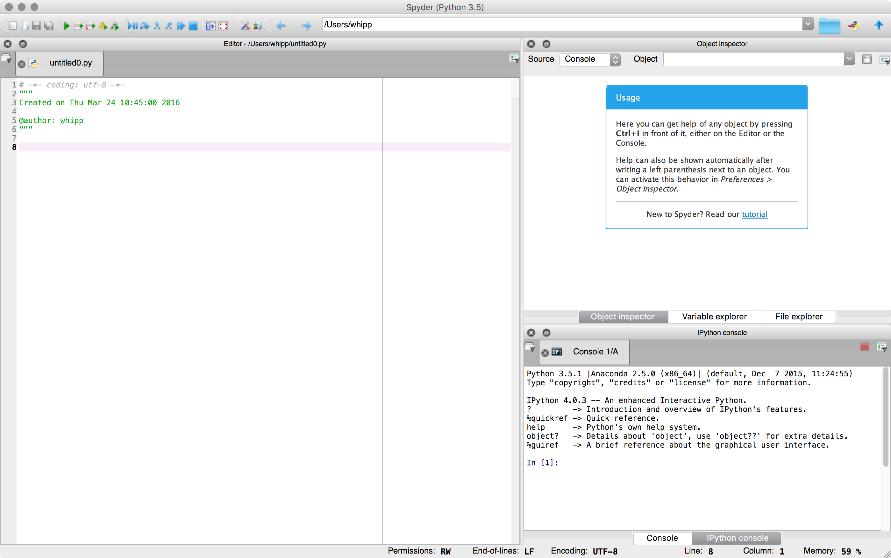

# Using Classroom for Github
For the remaining exercises in the course I plan to use [Classroom for Github](https://github.com/education/classroom). Here, I'll give you a sense of how Classroom for Github works and what you need to do to accept your assignments and turn in the exercises.

## Classroom for Github
Classroom for Github is basically an application that helps you make private copies of an assignment that you can modify and submit as your answers for the exercises. I create some template for an assignment that normlally would include the following:

- A basic description of the assignment
- A list of problems for you to solve/answer
- Some "starter" Python code or codes that you need to modify for the assignment
- Some data files to use with the Python scripts

For each exercise, I will post a link to the assignment. When you click the link, you will be taken to a webpage where you can accept the assignment [1]. When you accept the assignment a copy of it will be made in your personal Github repositories[2], and you will be asked to make changes to the Python code and main document for each assignment. More on that below.

## Working on the assignment
For most assignments you will be modifying the "starter" Python code that will be provided as part of the files copied to the assignment repository when you accept the assignment. After you get the code working, you will have questions to answer by modifying the main assignment document.

### Modifying the "starter" code
Here are some suggestions for working with the "starter" code.

- **Download the "starter" code**. You should first download a copy to your computer where you plan to work on the assignment. This computer should have a working installation of [Anaconda](Anaconda.md). You can download a copy of the code by clicking on it in the list of files you see for the assignment and then right-clicking on the **Raw** button above the Python code and selecting "Save Link As..." or the equivalent in your web browser. This will allow you to download a copy of the Python code to your computer.
- **Open Spyder**. Since you have a working Anaconda installation, you will have the [Spyder program](https://pythonhosted.org/spyder/), and Spyder will make it easy to modify and test your Python code. In the Linux computers in the computer classroom, you can launch Spyder by typing

    ```bash
    $ spyder
    ```
It may take a minute or two to open. In Windows you should have an application you can launch from the Start Menu, and on a Mac you can open the Anaconda Launcher on your Desktop and find Spyder there.
- **Load the "starter" code in Spyder**. Once you open Spyder you should see something like the window below.

    <br/>
You can open your code in Spyder by going to "File -> Open..." in the Menubar. Select the code you downloaded and you're ready to start editing.
- **Make changes and test**. You can edit your Python code in Spyder just like a normal editor and make whatever changes you would like. After you have made some changes and would like to test them, save your file using "File -> Save" in the Menubar. Now you can have Spyder run your code by clicking on the green play button at the top of the window or pressing the F5 key. Your code will run and the results (plots, printed text, errors, etc.) will be output to the IPython console on the bottom right panel. If you need more space to see the console, you can drag the margins on the console frame to make it bigger.
- **Upload your modified code**. After you have made some change to the code that you want to save, you should upload a copy to your assignment repository on Github. You can do this by clicking on the **Upload files** button on the main page of the assignment repository and selecting the Python code you have been editing on your computer. When you upload the file, be sure to give a nice short commit message stating what you changed in the code since the last time you uploaded. You are encouraged to upload a new copy of the Python code **every time** you make a change, such as fixing one of the problems in the starter code.

## Answering the questions


## Pro tips
- Frequent saves
- Embed your images in the `README.md`
- Nicer images

### Footnotes
[1]: Note that the first time you accept an assignment you will need to authorize the application on Github. This will not work if you have not verified your email address for your Github account.<br/>
[2]: A repository on Github is basically like a folder for a given assignment/project.
